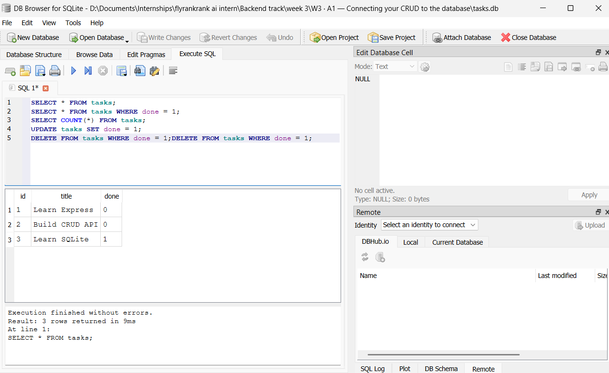
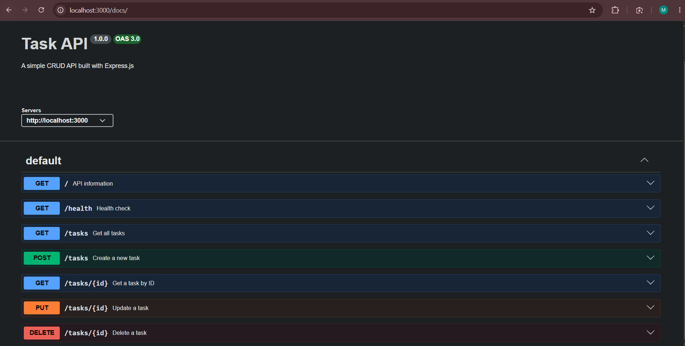

# W3 · A1 — Connecting Your CRUD API to SQLite

A RESTful Task API built with **Node.js, Express.js, and SQLite**.

This project is an extension of the previous CRUD API assignment. The original API stored tasks in an in-memory JavaScript array. In this version, the API has been connected to a **SQLite database** so that task data persists even after the server is restarted.

---

## Technologies Used

- **Node.js**
- **Express.js**
- **SQLite**
- **better-sqlite3**
- **Swagger UI**
- **OpenAPI**

---

## Features

- RESTful CRUD API
- SQLite database persistence
- Automatic database creation
- Automatic table creation
- Automatic insertion of example tasks when the database is empty
- JSON request and response handling
- Input validation
- Appropriate HTTP status codes
- Swagger/OpenAPI documentation
- Direct SQL database queries
- Data persistence across server restarts

---

# Project Structure

```text
.
├── docs/
│   ├── swagger-screenshot.png
│   └── sqlite-database.png
├── openapi.json
├── package.json
├── package-lock.json
├── server.js
├── tasks.db
├── .gitignore
└── README.md
```

> `tasks.db` is created automatically when the application starts if it does not already exist.

---

# Installation

## 1. Clone the repository

```bash
git clone <YOUR-GITHUB-REPOSITORY-URL>
```

## 2. Navigate into the project

```bash
cd <PROJECT-DIRECTORY>
```

## 3. Install dependencies

```bash
npm install
```

---

# Running the API

Start the server with:

```bash
node server.js
```

The API will be available at:

```text
http://localhost:3000
```

Swagger UI is available at:

```text
http://localhost:3000/docs
```

When the application starts, it automatically:

1. Opens or creates `tasks.db`.
2. Creates the `tasks` table if it does not exist.
3. Checks whether the table is empty.
4. Inserts three example tasks if the table is empty.

---

# Database

This project uses **SQLite** with the `better-sqlite3` package.

SQLite was chosen because it is lightweight, serverless, easy to configure, and stores the entire database in a single file. This makes it suitable for a small CRUD API and allows the project to run without installing or configuring a separate database server.

The database file is:

```text
tasks.db
```

The database is created automatically when the application starts.

---

## Database Schema

The application creates a table named `tasks`.

```sql
CREATE TABLE IF NOT EXISTS tasks (
    id INTEGER PRIMARY KEY,
    title TEXT NOT NULL,
    done BOOLEAN NOT NULL
);
```

The table contains:

| Column | Type | Description |
|---|---|---|
| `id` | INTEGER | Primary key and unique task identifier |
| `title` | TEXT | Task title |
| `done` | BOOLEAN | Indicates whether the task is completed |

---

# Example Tasks

When the database is empty, the application inserts three example tasks:

```text
1 - Learn Express
2 - Build CRUD API
3 - Learn SQLite
```

The example tasks are inserted **only when the table is empty**.

Therefore, restarting the server does not create duplicate example tasks.

---

# API Endpoints

| Method | Endpoint | Description |
|---|---|---|
| `GET` | `/` | Returns information about the API |
| `GET` | `/health` | Checks whether the API is running |
| `GET` | `/tasks` | Returns all tasks |
| `GET` | `/tasks/:id` | Returns a single task |
| `POST` | `/tasks` | Creates a new task |
| `PUT` | `/tasks/:id` | Updates an existing task |
| `DELETE` | `/tasks/:id` | Deletes a task |
| `GET` | `/docs` | Opens Swagger UI |

---

# API Usage

## 1. Get API Information

### Request

```http
GET /
```

### Response

```json
{
  "name": "Task API",
  "version": "1.0",
  "endpoints": ["/tasks"]
}
```

---

# 2. Health Check

### Request

```http
GET /health
```

### Response

```json
{
  "status": "ok"
}
```

---

# 3. Get All Tasks

### Request

```http
GET /tasks
```

### Example Response

```json
[
  {
    "id": 1,
    "title": "Learn Express",
    "done": 0
  },
  {
    "id": 2,
    "title": "Build CRUD API",
    "done": 0
  },
  {
    "id": 3,
    "title": "Learn SQLite",
    "done": 1
  }
]
```

The endpoint retrieves the tasks directly from SQLite using a SQL `SELECT` query.

---

# 4. Get a Single Task

### Request

```http
GET /tasks/1
```

### Example Response

```json
{
  "id": 1,
  "title": "Learn Express",
  "done": 0
}
```

### Task Not Found

Request:

```http
GET /tasks/99
```

Response:

```json
{
  "error": "Task 99 not found"
}
```

HTTP status:

```text
404 Not Found
```

---

# 5. Create a Task

### Request

```http
POST /tasks
```

### Request Body

```json
{
  "title": "Buy milk"
}
```

### Example Response

```json
{
  "id": 4,
  "title": "Buy milk",
  "done": 0
}
```

HTTP status:

```text
201 Created
```

The task is inserted into the SQLite database using an SQL `INSERT` query.

The database automatically generates the task ID.

---

## Invalid Create Request

Sending an empty body:

```json
{}
```

returns:

```json
{
  "error": "Title is required"
}
```

HTTP status:

```text
400 Bad Request
```

An empty title is also rejected.

---

# 6. Update a Task

### Request

```http
PUT /tasks/4
```

### Request Body

```json
{
  "title": "Buy milk and bread",
  "done": true
}
```

### Example Response

```json
{
  "id": 4,
  "title": "Buy milk and bread",
  "done": 1
}
```

HTTP status:

```text
200 OK
```

The update is performed using an SQL `UPDATE` query.

---

## Partial Update

The API also allows updating only one property.

For example:

```json
{
  "done": true
}
```

or:

```json
{
  "title": "New task title"
}
```

---

## Invalid Update

An empty request body:

```json
{}
```

returns:

```text
400 Bad Request
```

Trying to update a task that does not exist returns:

```text
404 Not Found
```

---

# 7. Delete a Task

### Request

```http
DELETE /tasks/4
```

### Response

```text
204 No Content
```

The task is permanently removed from the SQLite database.

If the task does not exist:

```http
DELETE /tasks/99
```

the API returns:

```json
{
  "error": "Task 99 not found"
}
```

with:

```text
404 Not Found
```

---

# HTTP Status Codes

| Status Code | Meaning |
|---|---|
| `200` | Request completed successfully |
| `201` | Resource successfully created |
| `204` | Resource successfully deleted |
| `400` | Invalid request |
| `404` | Requested task was not found |

---

# SQL Operations

The database can be opened directly using a SQLite database viewer such as **DB Browser for SQLite**.

The following queries were used to explore the database.

## List all tasks

```sql
SELECT * FROM tasks;
```

This returns every task in the database.

---

## Show completed tasks

```sql
SELECT * FROM tasks
WHERE done = 1;
```

This returns only completed tasks.

---

## Count all tasks

```sql
SELECT COUNT(*) FROM tasks;
```

This returns the total number of tasks.

---

## Mark all tasks as completed

```sql
UPDATE tasks
SET done = 1;
```

This changes every task to completed.

---

## Delete all completed tasks

```sql
DELETE FROM tasks
WHERE done = 1;
```

This removes all completed tasks from the database.

---

# Database Viewer

The SQLite database was inspected using a SQLite database viewer.



---

# Swagger UI

Swagger UI provides interactive documentation for the API.

After starting the server, open:

```text
http://localhost:3000/docs
```

Swagger provides a **Try it out** interface that allows the API endpoints to be tested directly from the browser.

You can use it to:

- Create tasks
- List tasks
- Get individual tasks
- Update tasks
- Delete tasks



---

# Example SQL Query

One of the queries executed directly against the SQLite database was:

```sql
SELECT * FROM tasks;
```

This query retrieves all rows from the `tasks` table.

Changes made directly to the database can then be observed through the API.

For example:

```text
SQLite Database
       ↓
   SQL UPDATE
       ↓
    tasks.db
       ↓
   GET /tasks
       ↓
   JSON Response
```

---

# Data Persistence

The main difference between this project and the previous in-memory version is **data persistence**.

### Previous version

```text
Express API
     ↓
JavaScript Array
     ↓
Server stops
     ↓
Data is lost
```

### Current version

```text
Express API
     ↓
SQL Query
     ↓
SQLite
     ↓
tasks.db
```

The data is stored on disk, so tasks remain available after restarting the server.

For example:

1. Create a task using `POST /tasks`.
2. Stop the server.
3. Start the server again.
4. Run `GET /tasks`.
5. The previously created task is still present.

---

# CRUD Architecture

The API now uses SQL operations for all CRUD functionality:

```text
              Express API
                   │
       ┌───────────┼───────────┐
       │           │           │
      GET         POST        PUT
       │           │           │
    SELECT       INSERT      UPDATE
       │           │           │
       └───────────┼───────────┘
                   │
                SQLite
                   │
               tasks.db
                   │
                DELETE
```

The four main CRUD operations are:

| CRUD Operation | HTTP Method | SQL |
|---|---|---|
| Create | `POST` | `INSERT` |
| Read | `GET` | `SELECT` |
| Update | `PUT` | `UPDATE` |
| Delete | `DELETE` | `DELETE` |

---

# Testing

The API can be tested using:

- Postman
- cURL
- Swagger UI

Example cURL request:

```bash
curl -i http://localhost:3000/tasks/1
```

Example POST request:

```bash
curl -i -X POST http://localhost:3000/tasks -H "Content-Type: application/json" -d "{\"title\":\"Buy milk\"}"
```

---

# Swagger/OpenAPI

The API documentation is defined in:

```text
openapi.json
```

Swagger UI uses this OpenAPI specification to provide interactive API documentation at:

```text
http://localhost:3000/docs
```

---

# What I Learned

This project covered:

- Building REST APIs with Express.js
- Handling HTTP requests and responses
- Parsing JSON request bodies
- Input validation
- RESTful CRUD operations
- SQLite database creation
- Database table creation
- SQL `SELECT`
- SQL `INSERT`
- SQL `UPDATE`
- SQL `DELETE`
- Parameterized SQL queries
- Database persistence
- Using `better-sqlite3`
- Inspecting SQLite databases
- Swagger/OpenAPI documentation
- Testing APIs using Postman, cURL, and Swagger UI

---

# Project Progress

This project was completed incrementally:

```text
Stage 0 — Create SQLite database          ✅
Stage 1 — Read from database              ✅
Stage 2 — Create new tasks                ✅
Stage 3 — Update and delete               ✅
Stage 4 — Explore SQLite                  ✅
Stage 5 — Database documentation          ✅
```

---

# Author

**Muhammad Talal Virk**

Software Engineering Student

This project was created as part of the Backend Engineering internship assignment.